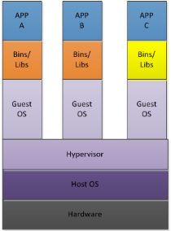
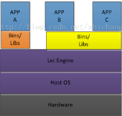

I. 云技术

&nbsp;&nbsp;&nbsp;&nbsp;当今互联网，总是围绕着 云技术、虚拟化和容器 在讨论，何为云技术？是指在广域网或局域网内将硬件、软件、网络等系列资源统一起来，实现数据的计算、储存、处理和共享的一种托管技术。云技术近几年发展极为迅猛，但还是在起步阶段，相对成熟的落地产品大致分为如下几类：

  - IaaS：Infrastructure as a Service，基础设施即服务，提供硬件平台，如阿里云的ECS、Amazon的EC2、私有的Docker平台
  - PaaS：Platform-as-a-Service，平台即服务，提供应用平台，用户只需调用接口即可使用，如阿里云的RDS、大鱼、短信网关等
  - SaaS：Software-as-a-Service，软件即服务，面向软件消费者，这个是应用最广泛的，如 Youtu、Gmail等
  - CasS：一个比较广义的术语，有表示Communications-as-a-Service，也有表示Container-as-a-Service

II. 虚拟化技术

&nbsp;&nbsp;&nbsp;&nbsp;虚拟化是云技术的核心部分，将分散的物理资源整合成一个对外的资源池，用户可按需利用资源池中的资源，从而最大化利用物理资源；虚拟化发展已经20几年，从简单的 VMware WorkStation到复杂的ESXi，都是虚拟化技术的典范，这类产品，我们行业统称VMM，Virtual Machine Manager, 又称Hypervisor。

&nbsp;&nbsp;&nbsp;&nbsp;VMM提供了一个虚拟层，其核心作用是为多个虚拟机操作系统提供虚拟的硬件驱动，然后将虚拟机操作系统发送的指令翻译为Host操作系统所识别的指令(包含逆向翻译)，按照我们的应用理解，基本工作原理如下：

  - 宿主机操作系统上安装VMM
  - 在VMM管理器中安装虚拟机操作系统并分配相关的硬件资源
  - 虚拟机操作系统工作时，将硬件资源的调用请求发给VMM
  - VMM翻译为宿主机系统所识别的指令，宿主机系统执行指令并返回给VMM
  - VMM翻译为虚拟系统能识别的指令并发送
  
&nbsp;&nbsp;&nbsp;&nbsp;VMM的优点是不关心宿主机OS，虚拟机支持各种OS，缺点是 至少两层内核调用、且需要经过VMM的翻译，资源调用效率低下。

III. 容器化技术

&nbsp;&nbsp;&nbsp;&nbsp;容器化的目的也是为了实现虚拟化，由于独特的性能和优势，我们习惯于将其独立为一门学科；现在最主流的当属LXC，即Linux container，由Linux内核实现，主流发行版默认支持和启用。我们留意下概念，LXC是内核技术，容器是依靠LXC实现的应用。

&nbsp;&nbsp;&nbsp;&nbsp;LXC由于没有VMM，每一个容器在宿主机中以进程的方式存在并运行，所以非常轻量、且硬件资源调度效率高，随着容器技术的发展和推广应用，它在IT项目的标准化管理、自动化集成与发布和云技术领域，扮演者越来越重要的角色，让我们一起来简单看一下，LXC几个重要的内核实现：
  - kernel namespace
  - cgroups
  - chroot
  - SELINUX(私有环境中少用)

&nbsp;&nbsp;&nbsp;&nbsp;kernel namespace是Linux的内核特性，用于系统资源的隔离，为容器之间的资源独立提供保障，隔离的对象包括但不限于：
  - pid namespace：  隔离container间的PID，各自拥有独立的进程空间
  - net namespace： 提供隔离的网络环境，包括网卡、路由、Iptable规则等
  - ipc namespace：  独立的进程间通信
  - uts namespace：  独立的主机名与域名
  - mnt namespace：独立的Rootfs
  - user namespace： 独立的用户和用户组

&nbsp;&nbsp;&nbsp;&nbsp;CGroups是Linux内核的cgroups子系统，基于进程组的资源管理框架，可实现按需分配容器可用资源和资源计费等功能。
  
